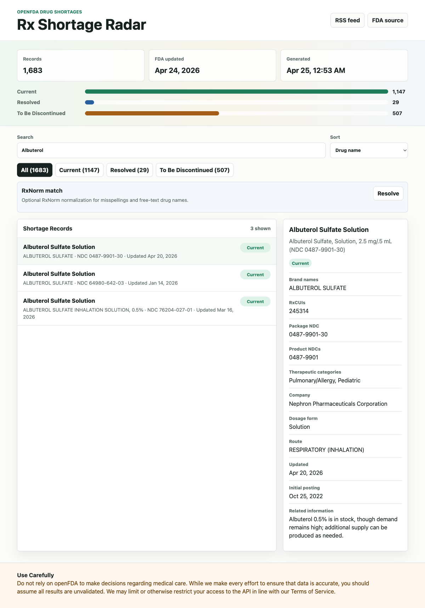

# Rx Shortage Radar

[](https://github.com/zzddddzz/rx-shortage-radar/actions/workflows/ci.yml)
[](https://github.com/zzddddzz/rx-shortage-radar/actions/workflows/deploy-pages.yml)
[](LICENSE)

Public FDA drug-shortage search, RxNorm-assisted medication matching, and RSS updates in one static dashboard.

[Live dashboard](https://zzddddzz.github.io/rx-shortage-radar/) | [CSV data](https://zzddddzz.github.io/rx-shortage-radar/data/shortages.csv) | [JSON schema](docs/data-schema.md) | [Glossary](docs/glossary.md) | [RSS feed](https://zzddddzz.github.io/rx-shortage-radar/feed.xml) | [Roadmap](ROADMAP.md)



## Why This Exists

Drug shortage data is public, but it is not always pleasant to search, subscribe to, or use in small projects. Rx Shortage Radar turns the FDA/openFDA shortage feed into a lightweight public dashboard, CLI, JSON dataset, and RSS feed.

This project is intentionally public-safe:

- Uses public FDA/openFDA and NLM RxNorm APIs only.
- Does not use patient data, hospital inventory, vendor files, or PHI.
- Preserves FDA source metadata and disclaimer in the generated dataset.
- Runs as a static site with no server-side database.

## What It Shows

- Current, resolved, and to-be-discontinued FDA shortage records.
- Search across generic name, brand name, RxCUI, NDC, company, route, and therapeutic category.
- RxNorm approximate matching for misspelled or free-text medication names.
- Status counts and source freshness.
- A downloadable JSON dataset at `site/data/shortages.json`.
- A downloadable CSV dataset at `site/data/shortages.csv`.
- Schema documentation for downstream consumers in `docs/data-schema.md`.
- RSS feeds for all records and each status:
  - `site/feed.xml`
  - `site/feed-current.xml`
  - `site/feed-resolved.xml`
  - `site/feed-discontinued.xml`

## Quick Start

```bash
python3 -m venv .venv
. .venv/bin/activate
python -m pip install -e .
rx-shortage-radar refresh --output site/data/shortages.json
rx-shortage-radar serve --root site --port 8765
```

Then open:

```text
http://127.0.0.1:8765/
```

Search from the terminal:

```bash
rx-shortage-radar search phenobarbital
rx-shortage-radar search amoxicillin --status Current
rx-shortage-radar search 0603-5167
rx-shortage-radar rxnorm "albutrol sulfate"
rx-shortage-radar export-csv --output site/data/shortages.csv
rx-shortage-radar feed --output site/feed.xml
```

## Data Sources

The generated dataset comes from the public openFDA drug shortages endpoint:

https://api.fda.gov/drug/shortages.json

openFDA documentation:

https://open.fda.gov/apis/drug/drugshortages/

The dataset includes FDA/openFDA metadata fields such as `last_updated`, `terms_url`, `license_url`, and `disclaimer`.

Medication name normalization uses the public NLM RxNorm approximate matching endpoint:

https://rxnav.nlm.nih.gov/REST/approximateTerm.json

RxNorm API documentation:

https://lhncbc.nlm.nih.gov/RxNav/APIs/RxNormAPIs.html

## Automation

This repo includes three GitHub Actions workflows:

- `ci.yml`: runs the Python unit tests.
- `refresh-data.yml`: refreshes JSON, CSV, and all RSS feeds daily, then commits changes.
- `deploy-pages.yml`: deploys the `site/` directory to GitHub Pages.

Optional: set `OPENFDA_API_KEY` as a repository secret if you want higher openFDA rate limits.

## Development

```bash
python -m unittest discover -s tests
python -m rx_shortage_radar refresh --max-records 25 --output /tmp/shortages.json
```

See [CONTRIBUTING.md](CONTRIBUTING.md) and [ROADMAP.md](ROADMAP.md) for focused starter tasks.

Dataset fields are documented in [docs/data-schema.md](docs/data-schema.md).

Terminology is explained in [docs/glossary.md](docs/glossary.md).

## Medical Disclaimer

Rx Shortage Radar is for public data exploration and software demonstration only. Do not use it to make medical decisions, clinical decisions, procurement decisions, or patient-care decisions. Confirm all shortage information with authoritative FDA sources, manufacturers, pharmacists, prescribers, and local policies.
